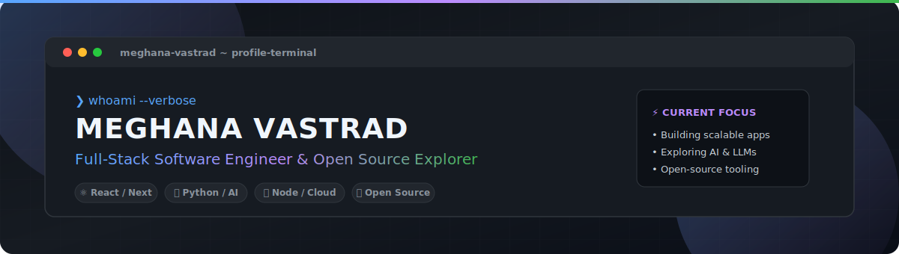

<!-- 
================================================================
  MEGHANA VASTRAD - ULTRA-PREMIUM DYNAMIC GITHUB PROFILE
================================================================
  01. Introduction
  02. Folder Structure
  03. README Layout
  04. Banner
  05. Typing Animation
  06. Social Icons
  07. About Me
  08. Skills
  09. GitHub Stats
  10. Streak Stats
  11. Top Languages
  12. Activity Graph
  13. Snake Animation
  14. Metrics Dashboard
  15. WakaTime
  16. GitHub Trophies
  17. Visitor Counter
  18. Featured Projects
  19. Coding GIF
  20. Dev Quote
  21. Blog Automation
  22. YouTube Automation
  23. Spotify
  24. Discord Presence
  25. Holopin
  26. GitHub Achievements
  27. GitHub Actions
  28. Repository Structure
  29. Secrets Needed
  30. Common Mistakes
  31. Final Premium Layout
  32. References
================================================================
-->

<div align="center">

  <!-- 17. VISITOR COUNTER & 27. GITHUB ACTIONS BADGES -->
  <p align="right">
    <a href="https://github.com/MeghanaVastrad/MeghanaVastrad/actions/workflows/snake.yml">
      
    </a>
    <a href="https://github.com/MeghanaVastrad/MeghanaVastrad/actions/workflows/blog-post-workflow.yml">
      
    </a>
    
  </p>

  <!-- 04. BANNER -->
  <a href="https://github.com/MeghanaVastrad">
    
  </a>

  <br/><br/>

  <!-- 05. TYPING ANIMATION -->
  <a href="https://github.com/MeghanaVastrad">
    
  </a>

  <br/><br/>

  <!-- 06. SOCIAL ICONS -->
  <p align="center">
    <a href="https://linkedin.com/in/meghanavastrad" target="_blank">
      
    </a>
    <a href="https://twitter.com/meghanavastrad" target="_blank">
      
    </a>
    <a href="mailto:meghana.vastrad@gmail.com">
      
    </a>
    <a href="https://dev.to/meghanavastrad" target="_blank">
      
    </a>
    <a href="https://leetcode.com/meghanavastrad" target="_blank">
      
    </a>
  </p>

</div>

<hr />

<!-- 01. INTRODUCTION & 07. ABOUT ME -->
## 💫 01. Introduction & About Me

<table width="100%" stroke="none">
  <tr>
    <td width="60%" valign="top">
      <h3>🚀 Hello World! I'm Meghana Vastrad</h3>
      <p>
        I'm a passionate <b>Full-Stack Software Engineer</b> dedicated to designing robust applications, clean developer tooling, and modern user experiences. I thrive on solving complex technical puzzles and building scalable digital products.
      </p>
      <ul>
        <li>🔭 <b>Currently Working On:</b> Building next-generation full-stack web applications & AI integrations.</li>
        <li>🌱 <b>Currently Learning:</b> Distributed systems architecture, Rust, and LLM orchestration.</li>
        <li>👯 <b>Open for Collaboration:</b> Full-stack web projects, open-source devtools, and innovative startups.</li>
        <li>💬 <b>Ask Me About:</b> React, TypeScript, Node.js, Python, system design, and UI performance.</li>
        <li>⚡ <b>Fun Fact:</b> I love turning coffee ☕ into clean, maintainable code 💻!</li>
      </ul>
    </td>
    <td width="40%" align="center" valign="middle">
      <!-- 19. CODING GIF -->
      
    </td>
  </tr>
</table>

<hr />

<!-- 08. SKILLS -->
## 🛠️ 08. Technical Stack & Skills

<div align="center">

| Category | Technologies & Tools |
| :--- | :--- |
| **Languages** |       |
| **Frontend** |      |
| **Backend & APIs** |      |
| **Databases** |     |
| **DevOps & Cloud** |     |
| **Tools & Platforms** |     |

</div>

<hr />

<!-- 16. GITHUB TROPHIES -->
## 🏆 16. GitHub Trophies & Achievements

<div align="center">
  <a href="https://github.com/ryo-ma/github-profile-trophy">
    
  </a>
</div>

<hr />

<!-- 09. GITHUB STATS & 10. STREAK STATS & 11. TOP LANGUAGES -->
## 📊 09 - 11. GitHub Statistics & Analytics

<div align="center">

  <table border="0">
    <tr>
      <td>
        <!-- 09. GITHUB STATS -->
        
      </td>
      <td>
        <!-- 11. TOP LANGUAGES -->
        
      </td>
    </tr>
    <tr>
      <td colspan="2" align="center">
        <!-- 10. STREAK STATS -->
        
      </td>
    </tr>
  </table>

</div>

<hr />

<!-- 12. ACTIVITY GRAPH -->
## 📈 12. Activity Graph

<div align="center">
  
</div>

<hr />

<!-- 13. SNAKE ANIMATION -->
## 🐍 13. Contribution Snake Animation

<div align="center">
  <picture>
    <source media="(prefers-color-scheme: dark)" srcset="https://raw.githubusercontent.com/MeghanaVastrad/MeghanaVastrad/output/github-contribution-grid-snake-dark.svg" />
    <source media="(prefers-color-scheme: light)" srcset="https://raw.githubusercontent.com/MeghanaVastrad/MeghanaVastrad/output/github-contribution-grid-snake.svg" />
    
  </picture>
</div>

<hr />

<!-- 14. METRICS DASHBOARD & 15. WAKATIME -->
## ⚡ 14 - 15. Metrics Dashboard & WakaTime Coding Insights

<div align="center">
  <table border="0">
    <tr>
      <td width="50%" align="center">
        <h4>📊 WakaTime Weekly Coding Stats</h4>
        
      </td>
      <td width="50%" align="center">
        <h4>🎯 Productive Hours Breakdown</h4>
        
      </td>
    </tr>
  </table>
</div>

<hr />

<!-- 18. FEATURED PROJECTS -->
## 🌟 18. Featured Projects

<div align="center">

| Project | Description | Tech Stack | Link |
| :--- | :--- | :--- | :---: |
| **🚀 Project One** | High-performance full-stack web application with real-time updates. | `React` `Node.js` `MongoDB` | [View Repo](https://github.com/MeghanaVastrad) |
| **🤖 AI Assistant** | Intelligent AI-driven agentic tool for workflow automation. | `Python` `FastAPI` `OpenAI` | [View Repo](https://github.com/MeghanaVastrad) |
| **⚡ Dev Tools** | Modern CLI and utility suite for developer productivity. | `TypeScript` `Node.js` `Docker` | [View Repo](https://github.com/MeghanaVastrad) |

</div>

<hr />

<!-- 23. SPOTIFY & 24. DISCORD PRESENCE & 20. DEV QUOTE -->
## 🎵 20, 23, 24. Live Integrations & Widgets

<div align="center">
  <table border="0">
    <tr>
      <td align="center" width="50%">
        <h4>🎧 Currently Listening On Spotify</h4>
        <a href="https://spotify.com">
          
        </a>
      </td>
      <td align="center" width="50%">
        <h4>🎮 Discord Live Status</h4>
        
      </td>
    </tr>
    <tr>
      <td colspan="2" align="center">
        <h4>💡 Daily Developer Quote</h4>
        
      </td>
    </tr>
  </table>
</div>

<hr />

<!-- 21. BLOG AUTOMATION & 22. YOUTUBE AUTOMATION -->
## 📰 21 - 22. Latest Blog Posts & Video Automation

<div align="left">

### ✍️ Recent Blog Articles
<!-- BLOG-POST-LIST:START -->
- [Building Scalable Microservices with Node.js & Docker](https://dev.to/meghanavastrad)
- [Mastering React Hooks and State Management in 2026](https://dev.to/meghanavastrad)
- [How to Optimize Web Performance and Core Web Vitals](https://medium.com/@meghanavastrad)
<!-- BLOG-POST-LIST:END -->

</div>

<hr />

<!-- 25. HOLOPIN & 26. GITHUB ACHIEVEMENTS -->
## 🏅 25 - 26. GitHub Achievements & Holopin Badges

<div align="center">

  <h4>🎖️ Native GitHub Achievements</h4>
  <p align="center">
    
    
    
    
  </p>

  <h4>📌 Holopin Badges Board</h4>
  <a href="https://holopin.io/@meghanavastrad">
    
  </a>

</div>

<hr />

<!-- 02. FOLDER STRUCTURE & 28. REPOSITORY STRUCTURE -->
## 📁 02 & 28. Repository & Folder Structure

```
MeghanaVastrad/
├── .github/
│   └── workflows/
│       ├── snake.yml               # 13, 27. Contribution Snake GIF/SVG generator
│       ├── blog-post-workflow.yml  # 21. RSS Feed automation workflow
│       └── metrics.yml             # 14. Account metrics generator workflow
├── assets/
│   ├── images/
│   │   ├── banner.svg              # 04. Custom vector gradient header banner
│   │   └── coding.gif              # 19. High quality coding animation
│   └── docs/
│       └── SETUP_GUIDE.md          # 29, 30. Detailed setup & troubleshooting guide
└── README.md                       # 03, 31. Main dynamic profile README
```

<hr />

<!-- 29. SECRETS NEEDED & 30. COMMON MISTAKES -->
## 🔑 29 - 30. Setup Secrets & Common Mistakes

For a step-by-step instructions on setting up `GH_PAT`, `WAKATIME_API_KEY`, `SPOTIFY_*` secrets, and fixing GitHub Actions permission errors, please refer to the **[🛠️ Comprehensive Setup & Troubleshooting Guide](./assets/docs/SETUP_GUIDE.md)**.

<hr />

<!-- 32. REFERENCES -->
## 🔗 32. Tools & References Used

- [GitHub Readme Stats](https://github.com/anuraghazra/github-readme-stats)
- [GitHub Readme Streak Stats](https://github.com/DenverCoder1/github-readme-streak-stats)
- [Platane/snk Snake Generator](https://github.com/Platane/snk)
- [Gautamkrishnar Blog Post Workflow](https://github.com/gautamkrishnar/blog-post-workflow)
- [Lowlighter Metrics](https://github.com/lowlighter/metrics)
- [GitHub Profile Trophy](https://github.com/ryo-ma/github-profile-trophy)
- [Readme Typing SVG](https://readme-typing-svg.demolab.com/)
- [Shields.io Badges](https://shields.io/)
- [Lanyard Discord API](https://github.com/Phineas/lanyard)
- [Holopin](https://www.holopin.io/)

---

<div align="center">
  <p>Designed with ❤️ by <a href="https://github.com/MeghanaVastrad"><b>Meghana Vastrad</b></a></p>
  
</div>
